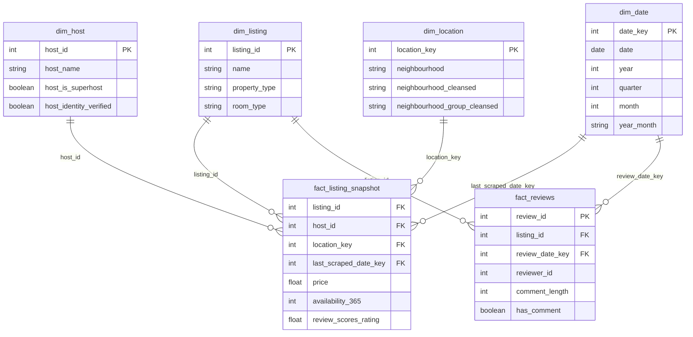

# Dashboard y modelo estrella

El dashboard consume los datasets gold separados:

```text
data/gold/listings.parquet
data/gold/reviews.parquet
```

Antes de visualizar, se construye un modelo estrella BI-ready en:

```text
data/gold/star/
```

## Modelo estrella



## Construccion

```bash
python -m src.pipeline.build_star_schema
```

Luego generar el dashboard:

```bash
python -m src.dashboard.airbnb_dashboard
```

Generar la vista visual del modelo estrella:

```bash
python -m src.dashboard.star_schema_view
```

Salida:

```text
dashboards/airbnb_quality_dashboard.html
dashboards/star_schema_view.html
```

## Escalabilidad a BI

Las tablas en `data/gold/star/` pueden importarse directamente a Power BI, Tableau o Looker Studio:

- `dim_listing.parquet`
- `dim_host.parquet`
- `dim_location.parquet`
- `dim_date.parquet`
- `fact_listing_snapshot.parquet`
- `fact_reviews.parquet`

Para herramientas que no lean Parquet directamente, se puede agregar export CSV sin cambiar el contrato conceptual del modelo.
