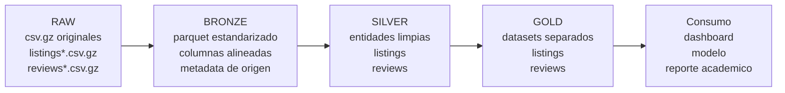

# Arquitectura Data Medallion

Esta rama implementa un flujo medallion basico y funcional para transformar archivos de Airbnb cargados en `data/raw` en dos datasets finales: `listings` y `reviews`.

## Convencion de carga

Los archivos nuevos deben conservar estos patrones:

```text
data/raw/listings*.csv.gz
data/raw/reviews*.csv.gz
```

Mientras respeten el mismo formato de columnas de Inside Airbnb, el pipeline los descubrira automaticamente y reconstruira las capas `bronze`, `silver` y `gold`.

## Pipeline visual



## Salidas

```text
data/bronze/listings_bronze.parquet
data/bronze/reviews_bronze.parquet
data/silver/listings.parquet
data/silver/reviews.parquet
data/gold/listings.parquet
data/gold/reviews.parquet
data/gold/listings.csv
data/gold/medallion_summary.json
app/medallion_viewer.html
```

## Ejecucion

```bash
python -m src.pipeline.run_medallion
```

Opciones utiles:

```bash
python -m src.pipeline.run_medallion --chunk-size 50000
python -m src.pipeline.run_medallion --no-csv
python -m src.pipeline.run_medallion --no-view
```

## Datasets gold

El pipeline genera dos datasets finales separados:

```text
data/gold/listings.parquet
data/gold/reviews.parquet
```

Tambien se genera una version CSV de `listings` para inspeccion rapida:

```text
data/gold/listings.csv
```

`data/gold/listings.parquet` queda a nivel `listing_id` e incluye atributos limpios de alojamientos:

- identificadores y datos del host
- ubicacion y tipo de propiedad
- capacidad, precio, disponibilidad y ratings declarados en listings

`data/gold/reviews.parquet` queda a nivel `review_id` e incluye:

- `listing_id`
- `review_id`
- `review_date`
- `review_year`
- `review_month`
- `reviewer_id`
- `comments`
- `comment_length`
- `has_comment`

## Interfaz visual

Despues de ejecutar el pipeline, abrir:

```text
app/medallion_viewer.html
```

La interfaz HTML muestra el recorrido raw -> bronze -> silver -> gold, conteos por capa y rutas de salida generadas.
